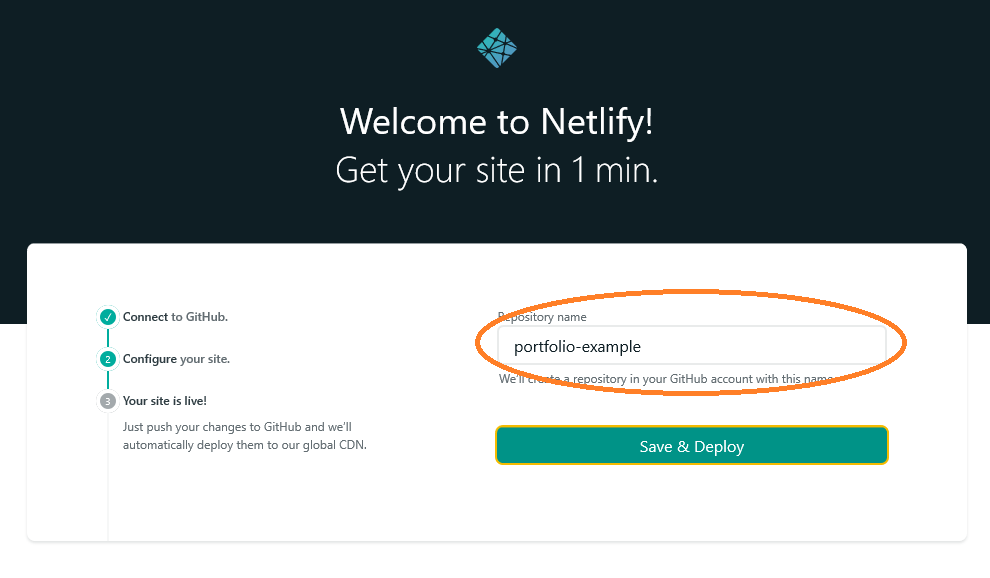
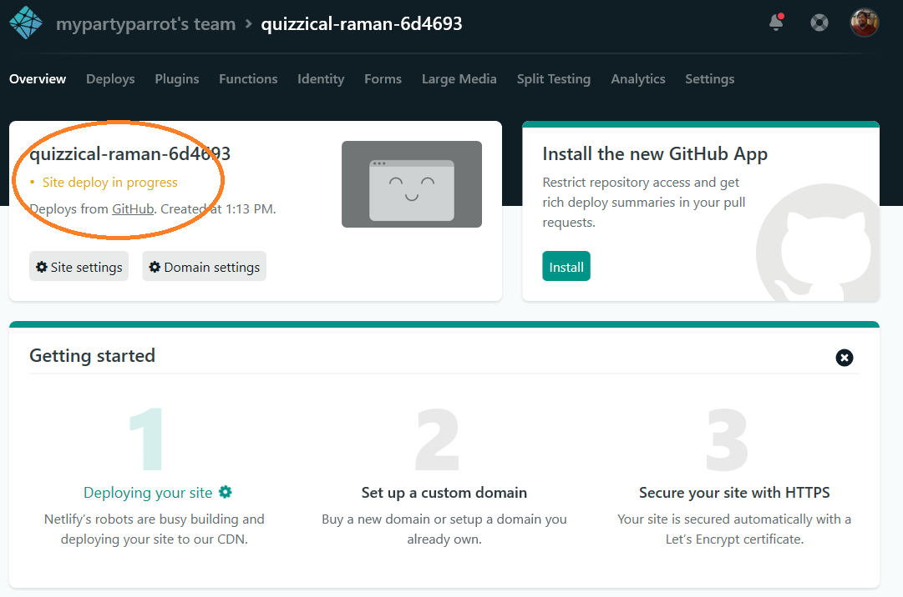

# Simple Hugo Portfolio Template

Simple hugo portfolio example derived from the forty theme. Designed to be used for Data Scientists sharing their R projects.

Inspired by Emi Tanaka's Showcase page: https://emitanaka.org/showcase/

Take a look at the example website: https://hugo-portfolio-example.netlify.app/

## Getting Started

1. To get started, sign up for GitHub and Netlify and click the following button.

[](https://app.netlify.com/start/deploy?repository=https://github.com/laderast/portfolio-example)

2. You'll then be asked to connect your Netlify account to GitHub. Click the `Connect to GitHub` button.


3. Name your repository anything you want:



then click the `Save and Deploy` button:


If you haven't authorized Netlify to connect to your account, you'll be asked to authorize it. Make sure to authorize before moving on.

4. You'll then move on to what's called the `deploy` page. Notice that in the top right, there is a yellow **deploy in progress** indicator. Wait a second.



5. You'll now see a green link in the top left corner. Click on it, and you'll see your brand new site!


Here's your brand new site:


6. That crazy name is the address of your site. To change it, you can click on the **Domain Settings** button: 


In the following page, click the Options >> Edit Site Name


7. Now you should start customizing your site. Click on the `config.toml` file and edit it (use the pencil in the top right corner) to start editing it.

Almost all elements are edited within the `config.toml` file. At the bare minimum, these are the fields you should customize.

Start by changing the fields with your name:

```
title = "Portfolio for Ted Laderas, PhD"
```

```
name = "Ted Laderas"
description = "Portfolio/CV for Ted Laderas"
```

Menu can be modified here. If you're not sure about this part, you can leave it be, other than changing the `title` and `subtitle`.

```
  [params.navigation]
    title = "Ted Laderas, PhD"
    subtitle = "Data Scientist and Collaborator"
    menu = "Menu"
    # Optional logo as brand stored in img/
    # logo = "logo.png"

    [[params.navigation.links]]
      name = "Home"
      url = "#"

    [[params.navigation.links]]
      name = "Blog"
      url = "blogs"

```

8. Edit the Banner information as well: 

```
  # Banner section
  [params.banner]
    # To change the background image on the homepage banner, replace 'banner.jpg' in
    # the 'static/img' folder.
    title = "Ted Laderas, PhD"
    subtitle = "Portfolio of Data Science and Visualization Projects"

```

Bask in your brand new site!


## Adding your projects

Adding a project as a tile on your main page is a three part process. You can put in knitted `.html` RMarkdown files, or links to other websites (such as a https://shinyapp.io shiny app).

1. Add a project Rmarkdown by adding a folder in the `content/projects` directory, and name your 
RMarkdown html file `index.html` in the folder (You can use the `Add File` button right above the file contents). Refer to the `url` as `projects/choropleth` (look in the `content/projects` folder for examples.)

2. (optional) Add an image for each tile in `static/image/projects/`, and refer to them in the `image` field as `projects/choropleth.png`.

3. Now add a `[[params.tiles.showcase]]` entry for your tile. It's probably easiest to copy and paste one of the tiles and edit it for right now.

You'll want to add your `url` to the `url` field, and if you have an `image`, add it to the `image` field. Make sure to edit the `title` and `subtitle`!

```
 [params.tiles]
    enable = true
    # Display your showcases here.
    
    [[params.tiles.showcase]]
      title = "Choropleths for Ready for R Class"
      subtitle = "Understanding our email list by country domain"
      image = "projects/choropleth.png"
      url = "projects/choropleth"

    [[params.tiles.showcase]]
      title = "Animal Crossing Tidy Tuesday"
      subtitle = "Understanding Character and Animal Types in Animal Crossing"
      image = "projects/ac.png"
      url = "projects/animal_crossing"
```

Enjoy your updated portfolio!

## Next Step: Cloning your project to your desktop

The next thing you'll want to do is save a local copy to your machine. That way, you can edit it in RStudio using the `blogdown` package and work on it on your machine.

* Learn more about Netlify, RMarkdown, and hugo file structure by watching [Sharing Online on Short Notice](http://rstd.io/sharing).

* Learn a bit about how Git and GitHub work by checking out [Happy Git and GitHub for the useR](https://happygitwithr.com/). 

* Then introduce yourself to the `blogdown` package via [blogdown: Creating Websites with RMarkdown](https://bookdown.org/yihui/blogdown/).

* Learn more about the hugo `forty` theme, which this website is based on: https://themes.gohugo.io/forty/

Be sure to share your web link with us! We want to see what you do with this.

